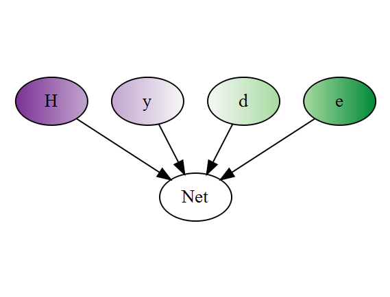

Hybrid Bayesian Networks Using R and JAGS
===

Facilities for easy implementation of hybrid Bayesian networks
using R. Bayesian networks are directed acyclic graphs representing joint
probability distributions, where each node represents a random variable 
and each edge represents conditionality. The full joint
distribution is therefore factorized as a product of conditional densities, 
where each node is assumed to be independent of its non-desendents given 
information on its parent nodes. Since exact, closed-form algorithms 
are computationally burdensome for inference within hybrid networks that contain
a combination of continuous and discrete nodes, particle-based approximation
techniques like Markov Chain Monte Carlo are popular.  We provide a user-friendly
interface to constructing these networks and running inference using rjags.
Econometric analyses (maximum expected utility under competing policies, value of
information) involving decision and utility nodes are also supported.

`HydeNet` may be installed using 

`install.packages("HydeNet")`

Patched versions from GitHub may be installed using

```
setRepositories(ind=1:2)
devtools::install_github("nutterb/HydeNet")
```

Please note that you may need to use the `ref` argument in `install_github` to get the latest
updates.  Please visit the [GitHub repository](https://github.com/nutterb/HydeNet)
to explore branches of the project.

The package includes a colletion of vignettes to help you get started.  Use `vignette(package = "HydeNet")` to see the complete listing of vignettes.
