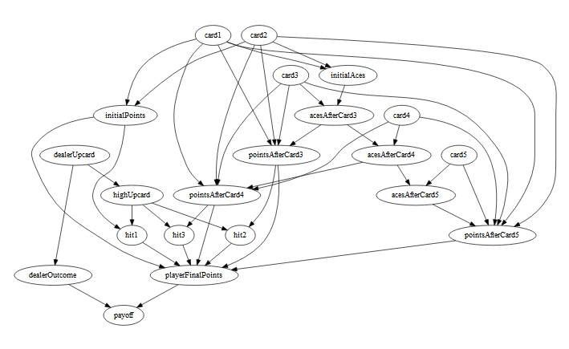
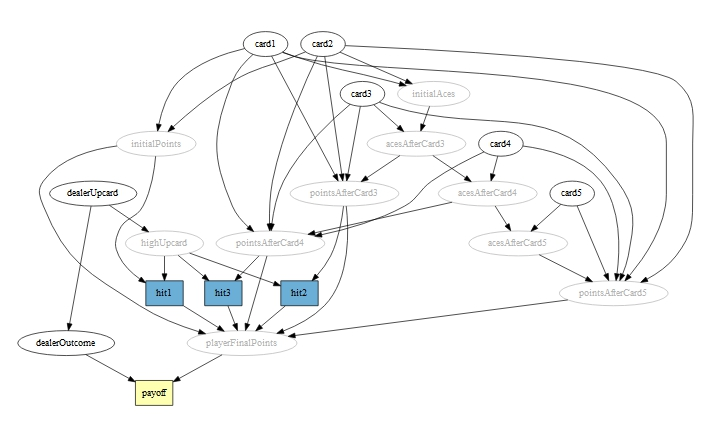

Decision networks are Bayesian networks where a subset of nodes represents *decisions* that may be chosen by an actor (or actors) and another subset of nodes represents *utilities* associated with certain outcomes. These networks are commonly referred to in the literature as *influence diagrams*. 

## Example Decison Network: Blackjack

In the ensuing discussion, we will use the casino game blackjack as our primary example of an influence diagram model. In blackjack, two cards are dealt to both the player and the dealer. Points are assigned to each card as follows:

|Card                     |Points         |
|:------------------------|:--------------|
|2 through 9              |Face Value     |
|Ten, Jack, Queen or King |10 Points      |
|Ace                      |1 or 11 points (player choice)|

For the dealer, one card (called the *upcard*) is dealt face up and the other is dealt face down. Thus, the player has only information on the upcard to guide decision-making. In the most basic form of the game (i.e., ignoring double-down, insurance and split decisions), the player is faced with the decision to *hit* or *stand*.  If the player chooses to hit, they are dealt another card and the points on that card are added to the player's previous total points.  If the total points adds to an amount greater than 21, the player *busts* (i.e., loses their money). Otherwise, the player is given another decision to hit or stand. This process continues until the player is either happy with their point total or they bust.  Once the player is all done taking cards (again, assuming they haven't busted), the dealer deals itself cards until its total is greater than or equal to 17 or it has busted. 

We have included some blackjack hand data in the package (data frame object `BlackJackTrain`) to demonstrate the process of populating these decision nodes. These data are completely fake, so results of our analysis should not be operationalized at the casino; besides, even the optimal "basic strategy" of deciding when and when not to take another card results in a net expected loss. Below is a somewhat unlucky sample of the dataset:

|dealerUpcard |card1 |card2 | initialPoints| hit1|card3 | pointsAfterCard3| hit2|card4 | pointsAfterCard4| hit3|
|:------------|:-----|:-----|-------------:|----:|:-----|----------------:|----:|:-----|----------------:|----:|
|10-K         |6     |4     |            10|    1|2     |               12|    1|10-K  |               22|     |
|10-K         |5     |9     |            14|    0|      |                 |     |      |                 |     |
|3            |8     |10-K  |            18|    0|      |                 |     |      |                 |     |
|8            |7     |10-K  |            17|    0|      |                 |     |      |                 |     |
|9            |9     |5     |            14|    1|2     |               16|    0|      |                 |     |
|10-K         |A     |2     |            13|    0|      |                 |     |      |                 |     |
|6            |10-K  |10-K  |            20|    0|      |                 |     |      |                 |     |
|7            |10-K  |8     |            18|    0|      |                 |     |      |                 |     |
|3            |4     |5     |             9|    1|A     |               20|    0|      |                 |     |
|10-K         |8     |5     |            13|    1|10-K  |               23|     |      |                 |     |
|10-K         |5     |4     |             9|    1|5     |               14|    1|6     |               20|    0|
|A            |8     |8     |            16|    0|      |                 |     |      |                 |     |
|10-K         |10-K  |10-K  |            20|    0|      |                 |     |      |                 |     |
|10-K         |10-K  |10-K  |            20|    0|      |                 |     |      |                 |     |
|6            |2     |6     |             8|    1|A     |               19|    0|      |                 |     |
|10-K         |10-K  |5     |            15|    0|      |                 |     |      |                 |     |
|5            |A     |4     |            15|    1|5     |               20|    0|      |                 |     |
|6            |5     |10-K  |            15|    0|      |                 |     |      |                 |     |
|10-K         |6     |10-K  |            16|    0|      |                 |     |      |                 |     |
|9            |6     |10-K  |            16|    1|10-K  |               26|     |      |                 |     |


To begin the modeling, we first construct a skeleton `HydeNet` model object, (i.e., a graphical model for which node characteristics have not yet been populated. See our vignette titled "Working with HydeNetwork Objects" for a general overview of network construction.

```{r, echo=FALSE, message=FALSE}
library(HydeNet)
```
```{r, fig.width=7, eval = 1}
net <- HydeNetwork(~ initialAces | card1*card2
                   + initialPoints | card1*card2
                   + highUpcard | dealerUpcard
                   + hit1 | initialPoints*highUpcard
                   + acesAfterCard3 | initialAces*card3
                   + pointsAfterCard3 | card1*card2*card3*acesAfterCard3
                   + hit2 | pointsAfterCard3*highUpcard
                   + acesAfterCard4 | acesAfterCard3*card4
                   + pointsAfterCard4 | card1*card2*card3*card4*acesAfterCard4
                   + hit3 | pointsAfterCard4*highUpcard
                   + acesAfterCard5 | acesAfterCard4*card5
                   + pointsAfterCard5 | card1*card2*card3*card4*card5*acesAfterCard5
                   + playerFinalPoints | initialPoints*hit1*pointsAfterCard3
                                         *hit2*pointsAfterCard4*hit3*pointsAfterCard5
                   + dealerOutcome | dealerUpcard
                   + payoff | playerFinalPoints*dealerOutcome)

plot(net)
```



Notice in the above network plot that all nodes have the same representation of empty black ovals. The `plot.HydeNetwork()` function allows for enhanced visualization of decision networks (see the vignette titled "Building and Customizing HydeNet Plots" for details; `vignette("HydeNetPlots", package="HydeNet")`), and since we have not yet specified the node types (i.e., random variable, deterministic, decision, or utility), it assumes that all nodes are random variables. Once we populate the network object with the node types and conditional distributions/deterministic functions, we will regenerate the plot.

First, we will populate the random variable and deterministic nodes using `setNode()` and `setNodeModels()`. Note that the deterministic node calculations are tedious due to the fact that an ace may mean 1 or 11 points depending on the other cards in the hand; we include the code for completeness but note that understanding the calculations are not critical to the general topic of decision networks.

```{r}
#####################################
# Random Variable Nodes
#####################################

# Note: The calls to 'setNode' below are going to generate messages
#       that validation has been ignored.  'setNode' assumes that when
#       you pass a character string as a parameter definition, you 
#       are passing JAGS code.  See the Validation section of the 
#       'setNode' documentation for more information.
#       After the first call, we'll turn off validation

cardProbs  <- c(rep(1/13,8), 4/13, 1/13)  # probs. for 2, 3, ..., 9, (10-K), A

net <- setNode(net, card1, nodeType="dcat",  pi=vectorProbs(p=cardProbs, card1))
net <- setNode(net, card2, nodeType="dcat",  pi=vectorProbs(p=cardProbs, card2),
               validate=FALSE)
net <- setNode(net, card3, nodeType="dcat",  pi=vectorProbs(p=cardProbs, card3),
               validate=FALSE)
net <- setNode(net, card4, nodeType="dcat",  pi=vectorProbs(p=cardProbs, card4),
               validate=FALSE)
net <- setNode(net, card5, nodeType="dcat",  pi=vectorProbs(p=cardProbs, card5),
               validate=FALSE)

net <- setNode(net, dealerUpcard, nodeType="dcat",
               pi=vectorProbs(p=cardProbs, dealerUpcard),
               validate=FALSE)

#Note: node dealerOutcome will be defined below, following some discussion 
#      about its conditional probability distribution.

#####################################
# Deterministic Nodes
#####################################
net <- setNode(net, highUpcard,     "determ", define=fromFormula(),
               nodeFormula = highUpcard ~ ifelse(dealerUpcard > 8, 1, 0))

net <- setNode(net, initialAces,    "determ", define=fromFormula(),
               nodeFormula = initialAces ~ ifelse(card1==10,1,0) + ifelse(card2==10,1,0))

net <- setNode(net, acesAfterCard3, "determ", define=fromFormula(),
               nodeFormula = acesAfterCard3 ~ initialAces + ifelse(card3==10,1,0))

net <- setNode(net, acesAfterCard4, "determ", define=fromFormula(),
               nodeFormula = acesAfterCard4 ~ acesAfterCard3 + ifelse(card4==10,1,0))

net <- setNode(net, acesAfterCard5, "determ", define=fromFormula(),
               nodeFormula = acesAfterCard5 ~ acesAfterCard4 + ifelse(card5==10,1,0))
               
net <- setNode(net, initialPoints, "determ", define=fromFormula(),
               nodeFormula = initialPoints ~ card1+card2+2)

net <- setNode(net, pointsAfterCard3, "determ", define=fromFormula(),
               nodeFormula = pointsAfterCard3 ~
                 ifelse(acesAfterCard3 == 3,
                    13,
                    ifelse(acesAfterCard3 == 2,
                       card1 + card2 + card3 + 3 - 10,
                       ifelse(acesAfterCard3 == 1,
                          ifelse(card1 + card2 + card3 + 3 > 22,
                             card1 + card2 + card3 + 3 - 10,
                             card1 + card2 + card3 + 3),
                          card1 + card2 + card3 + 3
                       )
                    )
                 )
              )

net <- setNode(net, pointsAfterCard4, "determ", define=fromFormula(),
               nodeFormula = pointsAfterCard4 ~
                 ifelse(acesAfterCard4 == 4,
                    14,
                    ifelse(acesAfterCard4 == 3,
                       ifelse(card1 + card2 + card3 + card4 + 4 > 38,
                          card1 + card2 + card3 + card4 + 4 - 30,
                          card1 + card2 + card3 + card4 + 4 - 20
                       ),
                       ifelse(acesAfterCard4 > 0,
                          ifelse(card1 + card2 + card3 + card4 + 4 > 22,
                                 card1 + card2 + card3 + card4 + 4 - 10,
                                 card1 + card2 + card3 + card4 + 4
                          ),
                          card1 + card2 + card3 + card4 + 4
                       )
                    )
                 )
              )

net <- setNode(net, pointsAfterCard5, "determ", define=fromFormula(),
               nodeFormula = pointsAfterCard5 ~ 
                 ifelse(acesAfterCard5 == 5,
                    15,
                    ifelse(acesAfterCard5 == 4,
                       ifelse(card1 + card2 + card3 + card4 + card5 + 5 > 51,
                          card1 + card2 + card3 + card4 + card5 + 5 - 40,
                          card1 + card2 + card3 + card4 + card5 + 5 - 30
                        ),
                       ifelse(acesAfterCard5 == 3,
                          ifelse(card1 + card2 + card3 + card4 + card5 + 5 > 51,
                             card1 + card2 + card3 + card4 + card5 + 5 - 30,
                             card1 + card2 + card3 + card4 + card5 + 5 - 20
                          ),
                          ifelse(acesAfterCard5 == 2,
                             ifelse(card1 + card2 + card3 + card4 + card5 + 5 > 31,
                                card1 + card2 + card3 + card4 + card5 + 5 - 20,
                                card1 + card2 + card3 + card4 + card5 + 5 - 10
                             ),
                             ifelse(acesAfterCard5 > 0,
                                ifelse(card1 + card2 + card3 + card4 + card5 + 5 > 22,
                                   card1 + card2 + card3 + card4 + card5 + 5 - 10,
                                   card1 + card2 + card3 + card4 + card5 + 5
                                ),
                                card1 + card2 + card3 + card4 + card5 + 5
                             )
                          )
                       )
                    )
                 )
              )

net <- setNode(net, playerFinalPoints, "determ", define=fromFormula(),
               nodeFormula = playerFinalPoints ~ 
                 ifelse(hit1 == 0,
                    initialPoints,
                    ifelse(hit2 == 0,
                           pointsAfterCard3,
                           ifelse(hit3 == 0, pointsAfterCard4, pointsAfterCard5)
                    )
                 )
              )

```

Node distributions for all random variable & deterministic nodes are now specified, other than `dealerOutcome`. We have included a dataset containing the conditional probability distribution of `dealerOutcome` given `dealerUpcard` in the data frame `BJDealer` (*source: https://www.blackjackinfo.com/dealer-outcome-probabilities. Accessed 2015-04-24.*). (These conditional probabilities assume that the dealer is drawing from a deck of infinite size.)

We will use the `cpt()` function to obtain an array that contains the conditional probabilities of `dealerOutcome` given `dealerUpcard`. This array has class `cpt` and can be fed into JAGS via `setNodeModels`:

```{r}
data(BJDealer)
dealerOutcome.cpt <- cpt(dealerOutcome ~ dealerUpcard,
                         data = BJDealer,
                         wt   = BJDealer$probability)
round(dealerOutcome.cpt,3)
net <- setNodeModels(net, dealerOutcome.cpt)
```

With this work completed, we will now proceed to designating the decision and utility nodes and populating their node distributions (or functions, in the case of deterministic nodes).

The first thing we will do is identify the decision and utility nodes, using the functions `setDecisionNodes()` and `setUtilityNodes()`. These functions merely set flags within the `HydeNetwork` object, to be used in the plot method for `HydeNetwork` objects as well as in later computations (e.g., computing expected utility of a decision):

```{r}
net <- setDecisionNodes(net, hit1, hit2, hit3)
net <- setUtilityNodes(net, payoff)

c(net$nodeDecision$hit2, net$nodeUtility$payoff)
```

We are now ready to visualize the finished decision network:

```{r, fig.width=7, eval=FALSE}
plot(net)
```



## Decision and Utility Nodes


**Decision nodes** can be thought of as ordinary nodes and fed into JAGS just as we would normally. We thus would populate their conditional distributions and/or deterministic functions in the same way that we're used to doing so. The reason we flag decision and utility nodes is that doing so allows us to conduct analyses which seek to maximize expected utility as it relates to decision-making strategies. Decision nodes therefore are assumed to be *manipulable* by the actor. We refer to a specific combination of decision nodes -- or a rule that dictates how decision nodes get assigned in response to observation of relevant information -- as a *policy*.

Decision nodes must have children nodes, and for every decision node in the network, there must be at least one utility node that is a decendant of it (although these need not be unique). When decision nodes have parents, the implication is that the parent nodes provide *information* that is used to guide the process of decision-making for that node. Hence, these links are called *information links*. For decision nodes that are random variables, we can think of their conditional probability distribution as a frequency (or, alternatively, a representation of belief) of observed decisions under distinct combinations of parent nodes within a population. For example, we may have data on observed hit/stand decisions in blackjack, from which logistic regression models can be estimated to characterize the relationship between point totals at certain hit decisions and probability of deciding to take another card.

Below, we make such models and incorporate them into the network. We have simplified dealer upcard information into a binary variable for this decision.

```{r}
data(BlackJackTrain)
BlackJackTrain$highUpcard <- as.character(BlackJackTrain$dealerUpcard)
BlackJackTrain$highUpcard <- factor(BlackJackTrain$highUpcard %in% c("10-K","A"),
                                    c(FALSE, TRUE), c("9 or lower", "10 or higher"))

# glm.hit1 <- glm(hit1 ~ initialPoints + I(dealerUpcard %in% c("9","10-K","A")),
#                 data = BlackJackTrain, family="binomial")

glm.hit1 <- glm(hit1 ~ initialPoints+highUpcard,
                data = BlackJackTrain, family="binomial")
glm.hit2 <- glm(hit2 ~ pointsAfterCard3+highUpcard,
                data = BlackJackTrain, family="binomial")
glm.hit3 <- glm(hit3 ~ pointsAfterCard4+highUpcard,
                data = BlackJackTrain, family="binomial")

net <- setNodeModels(net, glm.hit1, glm.hit2, glm.hit3)
```

Alternatively, decision nodes can be deterministic in nature. In this case, we interpret the function which sets the value of these nodes depending on the value(s) of its parent node(s) as a deterministic strategy that is chosen by the actor. Within the blackjack network, we might envision such a strategy by the following rule, which would be applicable to all three hit decisions in the network: choose 'hit' when the current point total is less than 15.

**Utility nodes** are restricted to be deterministic nodes with no descendents. In the blackjack example, for instance, we would assign the payoff utility node as follows:

```{r}
net <- setNode(net, payoff, "determ", define=fromFormula(),
         nodeFormula = factorFormula(payoff ~
                         ifelse(playerFinalPoints > 21, -1,
                           ifelse(playerFinalPoints == 21,
                             ifelse(dealerOutcome == 1, 0,
                               ifelse(dealerOutcome == 7, 0, 1)),
                             ifelse(dealerOutcome == 2,
                               ifelse(playerFinalPoints < 22, 1, -1),
                               ifelse(dealerOutcome == 3,
                                 ifelse(playerFinalPoints == 17, 0,
                                 ifelse(playerFinalPoints > 17, 1, -1)),
                                 ifelse(dealerOutcome == 4,
                                   ifelse(playerFinalPoints == 18, 0,
                                     ifelse(playerFinalPoints > 18, 1, -1)),
                                   ifelse(dealerOutcome == 5,
                                     ifelse(playerFinalPoints == 19, 0,
                                       ifelse(playerFinalPoints > 19, 1, -1)),
                                     ifelse(dealerOutcome == 6,
                                       ifelse(playerFinalPoints == 20, 0,
                                         ifelse(playerFinalPoints > 20, 1, -1)),
                                       ifelse(playerFinalPoints == 21, 0, -1))))))))))

```

The network model is now fully specified. This can be treated as an ordinary Bayesian network, ignoring the fact that some nodes represent decisions or utilites. For example, we can compile the network and feed it to JAGS with some evidence to obtain a MCMC sample of the joint posterior distribution of the unobserved nodes:

```{r}
trackedVars <- c("dealerUpcard","playerFinalPoints","dealerOutcome","payoff")
evidence <- list(card1 = 3)
compiledNet <- compileJagsModel(net, data = evidence,
                                n.chains = 3,
                                n.adapt = 5000)

post <- HydePosterior(compiledNet,
                      variable.names = trackedVars,
                      n.iter=10000)

dplyr::sample_n(post, 20)
```

And, we can do things like compute expected utility (under the distribution of hit decisions observed in the sample, i.e., absent any specific hit strategy) when dealt a 3:

```{r}
table(post$payoff)
mean(post$payoff)
```

## Maximum Expected Utility Analysis

In a maximum expected utility analysis, the goal is to compare different decision-making strategies, known as *policies*, in order to identify which one yields the greatest expected reward. With respect to our decision networks, this amounts to running the MCMC sampler with decision nodes set at specific values to get a representation of the joint posterior distribution of the utility nodes, and then adding their values to get a posterior distribution of total utility (from which we can get expected values, modes, etc.). We demonstrate this process below using the Blackjack network.

We will analyze the following four strategies: never choose to "hit", always take 3 cards, always take 4 cards, and always take 5 cards. Our set of discrete combinations of decision nodes can be represented by a *policy matrix*:

```{r}
policies <- data.frame(hit1 = c(0,1,1,1),
                       hit2 = c(0,0,1,1),
                       hit3 = c(0,0,0,1))
```

(Note: we have included a convenience function called `policyMatrix()` when all combinations of decision node values are of interest. This function is a wrapper for `expand.grid()`; see `help(policyMatrix)` for details.)

In the MEU analysis, the goal is to characterize the distribution of utility under the competing policies. This amounts to sampling posterior distributions of utility nodes under varying sets of values for the decision nodes. In `HydeNet`, this is done by 1) using the function `compileDecisionModel()` to create a list of `compiledHydeNetwork` objects (one object corresponding to each policy); 2) feeding that list to `HydePosterior()` to get a list of `coda.samples` objects; and finally 3) feeding the list of `coda.samples` objects to `bindPosterior()` to get a single posterior sample matrix for each policy:

```{r, echo=FALSE}
set.seed(39482820)
```

```{r}
compiledNets <- compileDecisionModel(net, policyMatrix = policies)

samples <- lapply(compiledNets,
                  HydePosterior,
                  variable.names = trackedVars,
                  n.iter=10000)

lapply(samples, head)
```

We now have a list of data frames, each data frame corresponding to one of the four hit policies (never hit, hit once, hit twice, and hit three times). Straightforward manipulations allow for examination of expected utility:

```{r}
#summary of expected utility under each policy
lapply(samples, function(l) mean(l$payoff))
```

We see that, among these four strategies, taking no cards appears to maximize expected utility (i.e., leads to losing the least amount of money.


<!--

## Value of Information Analysis

XXXXX

## Asymmetric Decision Problems

decision networks are tricky business. 3 types of asymmetry in decision networks. Currently, our package only allows for fully symmetric decision networks or networks that exhibit order asymmetry. However, careful use of the package to evaluate other situations is possible. We give some general guidance below on how to think about decision processes:

Decision/data process:  (A1, D1, A2, D2, ..., A_n-1, D_n-1, An)

-->


