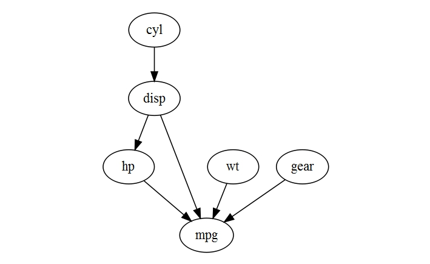

`HydeNet` is a package intended to facilitate modeling of hybrid Bayesian networks and influence diagrams (a.k.a. decision networks). A Bayesian network, formally defined, is a joint probability distribution for a set of random variables for which the set of conditional independencies can be represented using a directed acyclic graph. Each node represents a random variable, and each link represents the direction of influence between two nodes. The probability distribution for any given node is defined as conditional (only) on its parent nodes, and every node is conditionally independent from all of its non-descendants given data on its parent nodes.

Bayesian networks are powerful dynamic inference models that allow for updating predictions of unobserved nodes in the network as evidence is collected. They can be constructed using expert knowledge, or by using *structure learning* algorithms. `HydeNet` assumes the first approach: all networks are manually constructed through collaboration with subject matter experts. Users interested in structure learning problems --- which are popular in -omics applications, for example --- are encouraged to try the [`bnlearn` package](http://www.jstatsoft.org/v35/i03) by Marco Scutari.

Influence diagrams (or decision networks) are extended Bayesian networks which incorporate two additional types of nodes: decision nodes and utility nodes. Decision nodes are assumed to be manipulable by the actor, while utility nodes are deterministic functions of one or more parent nodes which produce numeric outputs. When there are multiple decision nodes in the network, specific combinations of decision node values are referred to as *policies*. We can use these networks to study the distribution of utility as it relates to various decision-making policies, and to conduct value-of-information analyses. An overview of using `HydeNet` for decision network analysis is provided in the **"Decision Networks"** vignette.

Packages exist for **exact** inference on standard Bayesian networks (e.g., `gRain`, `gRim`) when the networks do not have decision/utility nodes and fit any of the following criteria:

* All nodes are discrete/categorical in nature
* All nodes are Gaussian in nature
* All nodes are either Gaussian or discrete/categorical in nature (i.e., conditional linear gaussian models)

Exact inference on Bayesian networks is an *NP*-hard problem. When networks become large, either in the number of parameters in the number of nodes, exact inference algorithms such as junction tree are computationally expensive. In these situations, **approximate** inference may be an appealing alternative. Several methods for approximate inference on Bayesian networks exist. Popular methods include Markov Chain Monte Carlo sampling, application of the EM algorithm, and logic sampling (which is implemented in [`bnlearn`](http://www.jstatsoft.org/v35/i03)). `HydeNet` implements Markov Chain Monte Carlo inference through an interface to [JAGS](http://mcmc-jags.sourceforge.net/).

Fundamentally, HydeNet works by writing a JAGS script according to the structure and parameterization of your graphical model, and calling JAGS with that script. 

## `HydeNet` Installation

If you don't already have JAGS installed, you will receive an error when `HydeNet` tries to load the `rjags` package.  `rjags` searches your system for an installation of JAGS and throws an error if none is found.  You will need to [download and install JAGS](http://sourceforge.net/projects/mcmc-jags/files/) before using `HydeNet`.

Installing `HydeNet` from CRAN is straightforward and can be done with the usual syntax:
```{r, eval=FALSE}
install.packages("HydeNet")
```

If you wish to install a more recent or development version from GitHub, you may need to point R to the BioConductor repositories.  

```{r, eval=FALSE}
setRepositories(ind=1:2)
devtools::install_github("nutterb/HydeNet")
```

## A Simple Bayesian Network Analysis

First we load the library, and do some preliminary manipulation of the `mtcars` data frame:

```{r}
library(HydeNet)

mtcars2 <- transform(mtcars,
                     cyl = factor(cyl),
                     gear=factor(gear),
                     am = factor(am))
```

### Network Construction

The first step in the analysis is to set up the network structure. This is done using the `HydeNetwork()` function. The `formula` method for `HydeNetwork()` uses syntax similar to the `dag()` command in the `gRbase` library:

```{r}
carNet <- HydeNetwork(~ cyl
                      + disp | cyl
                      + hp | disp
                      + wt
                      + gear
                      + mpg | disp*hp*wt*gear,
                      data=mtcars2)
```

In the above, we have passed the training data frame `mtcars2` to be used for populating the parameters of the network. But, there are several ways to populate the node distributions:

1) automatically, by calling `HydeNetwork()` with a training dataset (as in the above);
2) manually, by calling `HydeNetwork()` with a list of model objects; and 
3) manually, by specifying only the network structure in the call to `HydeNetwork()` and then subsequently using the functions `setNode()` and `setNodeModels()` to specify distributions for each individual node.

In the automatic approach, estimation of the conditional probability distribution for each node (given its parent nodes) is performed using different models, depending on the nature of the node and the nature of its parent nodes. For example, conditional distributions of categorical nodes with all categorical parents are estimated using tabulation (see `help('cpt')`), while conditional distributions for categorical nodes with at least one continuous parent node are estimated using `glm(, family="binomial")`.

There are many options for manual specification of node distributions. Please refer to our **"Working with HydeNet Objects"** vignette (`vignette("WorkingWithHydeNetObjects", package = "HydeNet")`)for all the details on how to use `HydeNetwork()`, `setNode()` and `setNodeModels()` to create and populate network objects.

### Network Visualization

We have implemented a plot method for `HydeNetwork` objects, using the [`DiagrammeR`](https://CRAN.R-project.org/package=DiagrammeR) library by Richard Iannone et al. While not implemented in this simple example, there are different default node shapes and colors for random variable nodes, deterministic nodes, decision nodes and utility nodes. See our **"Building and Customizing HydeNet Plots"** vignette (`vignette("HydeNetPlots", package = "HydeNet")`)for details on customization.

```{r, fig.width = 5, eval=FALSE}
plot(carNet)
```


## Interfacing with JAGS

`HydeNet` interfaces with JAGS through the `rjags` package. Given a fully-specified `HydeNetwork` model, the function `writeNetworkModel()` will create the JAGS model script (by calling the `writeJagsModel()` function for each node, which creates each node's portion of the script).  Here's an example (note, as indicated by the need to use a triple colon, that `writeJagsModel()` is not an exported function to the `HydeNet` namespace):

```{r}
HydeNet:::writeJagsModel(carNet, node = "cyl")
HydeNet:::writeJagsModel(carNet, node = "mpg")

writeNetworkModel(carNet, pretty = TRUE)
```

In practice, though, the function `compileJagsModel()` (or `compileDecisionModel()`, if the network contains decision and utility nodes) will typically be called. This function is a wrapper for the `jags.model()` function in the `rjags` library which, in addition to the JAGS model script, passes any conditional probability tables from the network model into JAGS as arrays. (Note: all other arguments to `jags.model()`, such as the number of chains initial values, and the number of iterations for adaptation are passed through to the function.)

The functions `compileJagsModel()` and `compileDecisionModel()` essentially return augmented objects of class `jags`. We label these objects with the class `compiledHydeNetwork`.

```{r}
carNet1 <- compileJagsModel(carNet)
```

Evidence on individual nodes can also be entered with `compileJagsModel()`, thus facilitating dynamic inference as data are observed. See the description of the `data` argument in `help(rjags::jags.model)` for details. 
```{r}
carNet2 <- compileJagsModel(carNet, data = list(cyl = "8") )
```

As a matter of convenience, `HydeNet` can also translate labels into the numeric codes
```{r}
carNet3 <- compileJagsModel(carNet, data=list(cyl="8"))
```


## MCMC Inference

MCMC sampling is performed by calling `HydePosterior()`. This function calls `coda.samples()` from the `rjags` library and returns an augmented `mcmc.list` object.  MCMC diagnostics and inference from this point onward are performed in the same manner as would typically be done when using `rjags`.

```{r, fig.width=6, fig.height=6}
post1 <- HydePosterior(carNet1,
                       variable.names = c("cyl","hp","mpg"),
                       n.iter = 10000,
                       bind=FALSE)

post2 <- HydePosterior(carNet2,
                       variable.names = c("cyl","hp","mpg"),
                       n.iter = 10000,
                       bind = FALSE)

str(post1, max.level = 3)
plot(post1$codas[,c("hp","mpg")])
```

We have included a convenience function called `bindPosterior()` than can be used to combine multiple chains' samples into a single data frame with all factors re-mapped to their original non-numeric values.

Below, we apply the function to obtain posterior densities under each of the two scenarios (no observation of other nodes and after observation of cyl = "8", respectively):

```{r}
bp1 <- bindPosterior(post1)
bp2 <- bindPosterior(post2)

head(bp1)
head(bp2) #notice cyl = "8" for all samples

plot(density(bp1$hp), ylim=c(0,0.06), main = "hp");
lines(density(bp2$hp), col="red", lty=5)

plot(density(bp1$mpg), main = "mpg");
lines(density(bp2$mpg), col="red", lty=5)
```

## Global `HydeNet` Options
There are a couple of global options `HydeNet` establishes that you should be aware of.  

### `Hyde_fitModel`
The `Hyde_fitModel` controls the behavior of `setNode` function.  If `FALSE`, the model described by the arguments will not be fit until the JAGS model statement is written by `writeNetworkModel`.  

The option can be set by using the code below.  The default setting is `FALSE`.

```{r, eval=FALSE}
options(Hyde_fitModel=FALSE)
```

Realistically, the time spent to fit the model will be spent one way or another, and it's a matter of preference for where you spend that time.  If you wish to do it
all at once when calling `writeNetworkModel`, set the option to `FALSE`.  Your printed output when reviewing a network will appear as follows:

```{r, echo=FALSE}
data(PE, package='HydeNet')
autoNet <- HydeNetwork(~ wells
                       + pe | wells
                       + d.dimer | pregnant*pe
                       + angio | pe
                       + treat | d.dimer*angio
                       + death | pe*treat,
                       data = PE)
autoNet <- setNode(autoNet, treat,
                   nodeFormula = treat ~ poly(d.dimer, 2) + angio,
                   prob = fromData())
```
```{r, echo=FALSE}
print(autoNet, treat)
```

Notice that the `mu` and `tau` parameters are not explicitly defined, but only give a notice that they will be estimated from the data.

If the `Hyde_fitModel` option is set to `TRUE`, the output would appear as follows:
```{r, echo=FALSE}
library(HydeNet)
options(Hyde_fitModel=TRUE)
data(PE, package='HydeNet')
autoNet <- HydeNetwork(~ wells
                       + pe | wells
                       + d.dimer | pregnant*pe
                       + angio | pe
                       + treat | d.dimer*angio
                       + death | pe*treat,
                       data = PE)
autoNet <- setNode(autoNet, treat,
                   nodeFormula = treat ~ poly(d.dimer, 2) + angio,
                   prob = fromData())
print(autoNet, treat)
```


### `Hyde_maxDigits`
This options, set to 5 by default, controls the number of decimal places printed in the JAGS model code.  It can be increased or decreased depending on the level of precision you need or want in your estimates.

```{r}
library(HydeNet)
data(PE, package='HydeNet')
autoNet <- HydeNetwork(~ wells
                       + pe | wells
                       + d.dimer | pregnant*pe
                       + angio | pe
                       + treat | d.dimer*angio
                       + death | pe*treat,
                       data = PE)
writeNetworkModel(autoNet, pretty=TRUE)
```

If 5 digits is too much for your taste:

```{r}
library(HydeNet)
options(Hyde_maxDigits=2)
data(PE, package='HydeNet')
autoNet <- HydeNetwork(~ wells
                       + pe | wells
                       + d.dimer | pregnant*pe
                       + angio | pe
                       + treat | d.dimer*angio
                       + death | pe*treat,
                       data = PE)
writeNetworkModel(autoNet, pretty=TRUE)
```

## A Note About Printing
**This note applies to R versions less than 3.2.**

You may notice throughout the vignettes that we tend to call the print function explicitly.  That is, we use `print(object)` instead of simply submitting `object` to the console.  The `HydeNet` objects can get pretty large, and the implicit printing can become pretty slow as a result.  Consider the following comparison:

```{r, eval=FALSE}
> #* Object based on a list of models
> g1 <- lm(wells ~ 1, data=PE)
> g2 <- glm(pe ~ wells, data=PE, family="binomial")
> g3 <- lm(d.dimer ~ pe + pregnant, data=PE)
> g4 <- xtabs(~ pregnant, data=PE)
> g5 <- glm(angio ~ pe, data=PE, family="binomial")
> g6 <- glm(treat ~ d.dimer + angio, data=PE, family="binomial")
> g7 <- glm(death ~ pe + treat, data=PE, family="binomial")

> bagOfModels <- list(g1,g2,g3,g4,g5,g6,g7)
> bagNet <- HydeNetwork(bagOfModels)

> #* Time to print bagNet implicitly
> a <- Sys.time()
> bagNet
> b <- Sys.time()
> b-a
Time difference of 33.53736 secs

> #* Time to print bagNet explicitly
> a <- Sys.time()
> print(bagNet)
> b <- Sys.time()
> b-a
Time difference of 0 secs
```


