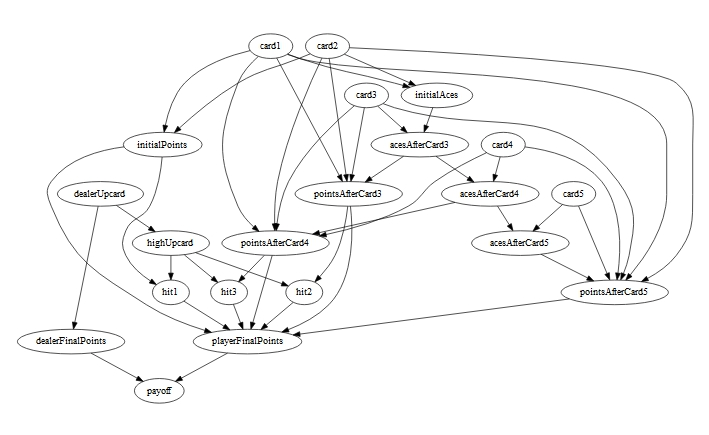
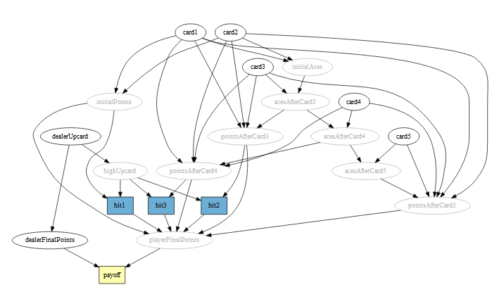
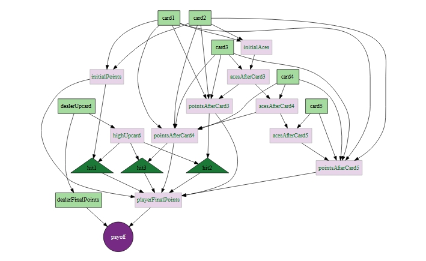
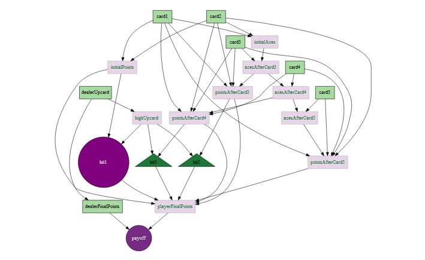
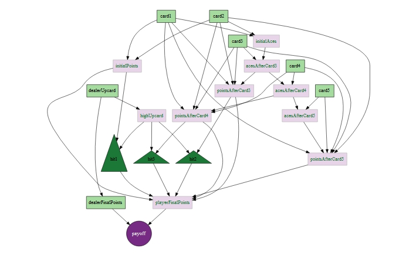
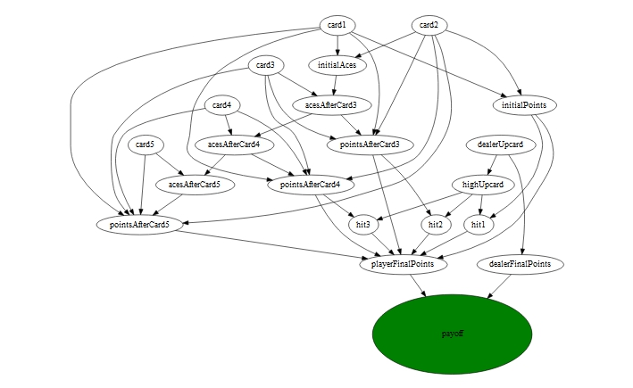

Visualizing your graphical network will be critical to explaining the relationships between the variables in your model. While the printed output explicitly defines the nature of the relationships, the visual representation usually makes it easier to see how all the pieces fit together and evaluate if all of the important relationships have been assembled correctly.

The `HydeNet` package utilizes the functionality GraphViz package to quickly illustrate the relationships. `HydeNet` also provides additional tools to address the inherent differences between random variables, deterministic nodes, decision nodes, and utility nodes.  Finally, with `HydeNet`, tools are available to easily customize the appearance of nodes to suit your needs.

### A note on `GraphViz`
GraphViz, or Graphical Visualization Software, is "a way of representing structural information as diagrams of abstract graphs and networks" [1].  It is open source software that the `DiagrammeR` package utilizes through available libraries and APIs.  

We only cover a very small subset of the capabilities available through the `DiagrammeR` package. A great many customizations may be accomplished, but it is left to the user to research how to make those customizations beyond the basics provided here.

## Basic Graphical Network Plots
To illustrate the graphical representations of `HydeNetwork` objects, we will use the `BlackJack` data set that comes as part of the package.  `BlackJack` is a hybrid decision network that simulates the card game of the same name [2].  We won't construct the network here because the code is fairly lengthy.  However, the code to construct the object can be reviewed by typing `?BlackJack` into the console.

The key aspects of this network are that it contains

* seven random nodes
* ten deterministic nodes
* three decision nodes
* one utility node

When you load `HydeNet`, it will define some default settings for each of these nodes, but before we show you those settings, let's take a look at what the GraphViz would return if we chose not to use anything but its defaults.

```{r, eval=1:2}
library(HydeNet)
data(BlackJack, package="HydeNet")
plot(BlackJack, useHydeDefaults=FALSE)
```


The figure above shows every node in the network in a circle with white fill and black text. In a decision network, however, different nodes may be inherently different.  It would be helpful to be able to distinguish between random variables, deterministic nodes, decision nodes, and utility nodes.  The `plot.HydeNetwork` method uses the package's default settings to distinguish these types of nodes and can produce the figure below.

What we will see is:

* Random variables are printed in black ellipses with black text.
* Deterministic nodes are printed in gray ellipses with gray text.  
  Deterministic nodes are defined by their parents and are not assigned 
  prior distributions.
* Decision nodes are printed in rectangles with a blue background. Decision 
  nodes are places where we can make changes in what happens in the structure 
  of the network.  In this case, do we want to take another card from the 
  dealer (a hit) or remain content with the cards in hand?
* Utility nodes are printed in rectangles with a yellow background. Utility
  nodes are deterministic nodes with no children that are usually of special 
  interest.  In this case the utility node is the payoff from the game.

```{r, eval=FALSE}
plot(BlackJack)
```


### Customizing the Default Settings
We understand that it's possible that you won't find our default settings appealing.  That's okay, we promise that our feelings aren't hurt. In fact, we're willing to help!  

The default plot settings are governed by a global option.  You can view the settings this way:

```{r}
getOption("Hyde_plotOptions")
```

Let's assume that you only want to change the default scheme.  That is, you want the representation of each node to depend on its type.  We can assign `GraphViz` attributes to a types by using the `HydePlotOptions` function.  To demonstrate, let's change the defaults so that:

* random variables are in green rectangles black text
* deterministic nodes are in black rectangles with white text
* decision nodes are in yellow ellipses with black text and red borders
* utility nodes are in red circles with white text

```{r, eval=1}
HydePlotOptions(variable=list(shape = "rect", fillcolor = "#A6DBA0"),
                determ = list(shape = "rect", fillcolor = "#E7D4E8",
                              fontcolor = "#1B7837", linecolor = "#1B7837"),
                decision = list(shape = "triangle", fillcolor = "#1B7837",
                                linecolor = "white"),
                utility = list(shape = "circle", fillcolor = "#762A83", 
                               fontcolor = "white"))
plot(BlackJack)
```


And at this point, if you decide that maybe our default color scheme really wasn't so bad, there's an easy way to go back, too.

```{r, eval=FALSE}
HydePlotOptions(restorePackageDefault=TRUE)
plot(BlackJack)
```


### Customizing Individual Nodes
The last thing you might want to do, from time to time, is customize an individual node.  For instance, you might want to highlight one particular decision.  In our case, let's focus on the decision to take the first hit.  To make this node stand out, let's make it a purple circle.

To do this, we'll need to use the `customNode` function.  It's easiest to do this right within the plot call.  We'll even change the size of the node to really make it pop.

```{r, eval=FALSE}
plot(BlackJack,
     customNodes = customNode(node_id = "hit1",
                              fillcolor = "purple", shape = "circle",
                       fontcolor = "white", height = "2",
                       style="filled"))
```


Or if we would rather show a series of plots walking through the three decisions, we might not want to change the node appearance, but only the size.

```{r, eval = FALSE}
plot(BlackJack,
     customNodes = customNode(node_id = "hit1", height = "2"))
plot(BlackJack,
     customNodes = customNode(node_id = "hit2", height = "2"))
plot(BlackJack,
     customNodes = customNode(node_id = "hit3", height = "2"))
```



The way that the node customization works is that it only applies custom attributes _after_ establishing the plot defaults.  You may also alter the appearance of 
multiple nodes simultaneously

```{r, eval=FALSE}
plot(BlackJack,
     customNodes = rbind(customNode(node_id = "hit1", height="2"),
                         customNode(node_id = "hit2", height="2"),
                         customNode(node_id = "hit3", height="2")))
```


And, of course, if you want to use a custom node appearance without all of the `HydeNet` defaults, you may always do the following:

```{r, eval=FALSE}
plot(BlackJack,
     customNodes = customNode(node_id = "payoff", 
                              fillcolor = "green", 
                              shape = "ellipse", 
                              height="2", 
                              width="4",
                              style="filled"),
     useHydeDefaults = FALSE)
```


## Conclusion
`HydeNet` is a tool to assist in generating and evaluating hybrid decision networks.  Displaying the network is an important aspect of communicating the relationships established by your network.  The `HydeNet` plotting tools provide the basic functionality needed to express both generic and customized plots suitable for sharing and evaluating network models.


## References
[1] Graphviz, "About Graphviz," Retrieved from [http://www.graphviz.org/About.php](http://www.graphviz.org/About.php).  
[2] Bicycle Cards, "Blackjack," Retrieved from [http://www.bicyclecards.com/card-games/rule/blackjack](http://www.bicyclecards.com/card-games/rule/blackjack].