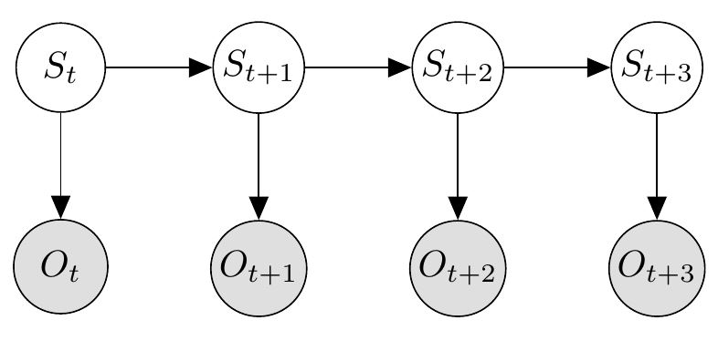

```{r, echo=FALSE, warning=FALSE, message=FALSE}
require(HydeNet)
```


Many possibilities exist for modeling systems over time. When Bayesian networks are used to model time-dependent systems, they're called *temporal Bayesian networks (TBNs)*. Broadly speaking, there are two classes of temporal systems models -- those that involve continuous time and those that involve discrete time (e.g., day 1, day 2, day 3, and so on). While there is theoretically nothing stopping the user from using `HydeNet` (or JAGS, for that matter) to model continuous-time temporal networks, we sought to achieve a balance between usability and flexibility in defining our `TBN` object class using discrete time. Nonetheless, the model structure is powerful in the sense that it generalizes several popular techniques, including *Kalman filters* and *vector autoregressive (VAR) processes* (temporal networks of continuous Gaussian variables), *hidden Markov models* (HMMs) and other *state-space models*, and many of their [different flavors](http://www.cs.ubc.ca/~murphyk/Thesis/thesis.html), as we describe below. See Murphy (2002) for a more in-depth review of TBNs.

## Markovian Models

Most generally, a TBN is a stochastic process defined over time. Oftentimes, such networks are specified under the assumption that the probablity distribution of all future states of the system is conditionally independent of all past states of the system given the present state of the system. In other words, if we know the present state of the system (in its entirety), then all information on past states is not needed for predicting the future. This is known as the *Markov property* (or *Markov assumption*). Models which employ the Markov property are *Markovian models*.

The probabilistic properties of TBNs naturally allow for Markovian model specification. In all Bayesian networks, each node is conditionally independent from all its non-descendents given knowledge of (data on) its parent nodes. TBNs are structured in a way that all nodes at time $u>t$ are descendents of all nodes at time $t$; therefore, if we have knowledge of all nodes at time $t$, then beliefs about any node at time $u$ is unaffected by the values of (or beliefs about) nodes at any time $s<t$.

## State-Space Models

State-space models are Markovian models over time which assume that a latent (unobservable) system state dictates the probabilistic properties of the observable variables. Specifically, in state-space models, there are $N_s$ latent time-varying *state variables* $s_{tj}$ $\left ( j \in \left \{ 1, 2, \cdots, N_s \right \} \right )$ that determine the distribution of $N_o$ *observation variables* $o_{tj}$ $\left ( j \in \left \{ 1, 2, \cdots, N_o \right \} \right )$ at any time point $t$. Let $\boldsymbol{S_t} = \left [s_{tj} \right ]^T$ and let $\boldsymbol{O_t} = \left [o_{tj} \right ]^T$. The general network structure for a state-space model over four time points is given in the below diagram (note that the nodes in this diagram could represent either single variables or subnetworks of multiple variables, where such subnetworks are also directed and acyclic):



Probabilistically, this system is factorized according to the structure of the Bayesian network. That is, the joint distribution of all state variables $\mathbb{S} = \left \{ \boldsymbol{S_1},\boldsymbol{S_2}, \cdots, \boldsymbol{S_T} \right \}$ and all observation variables $\mathbb{O} = \left \{ \boldsymbol{O_1},\boldsymbol{O_2}, \cdots, \boldsymbol{O_T} \right \}$ over the time horizon $t \in {1, 2, \cdots, T}$ is a product of time-specific distributions:

$$\begin{align}
Pr \left( \mathbb{S},\mathbb{O} \right ) & = \prod_{t=1}^{T} Pr \left ( \boldsymbol{S}_t, \boldsymbol{O}_t \right ) \\
& = Pr \left ( \boldsymbol{S}_1 \right ) Pr \left (\boldsymbol{O}_1 | \boldsymbol{S}_1 \right ) \prod_{t=2}^{T} Pr \left ( \boldsymbol{S}_t | \boldsymbol{S}_{t-1} \right ) Pr \left ( \boldsymbol{O}_t | \boldsymbol{S}_t \right ) \\ 
& = Pr \left ( S_1 \right ) \prod_{t=2}^{T} Pr \left ( \boldsymbol{S}_t | \boldsymbol{S}_{t-1} \right ) \prod_{t=1}^{T} Pr \left ( \boldsymbol{O}_t | \boldsymbol{S}_t \right ) .
\end{align}
$$

This probabilistic model is frequently further simplified into distinct substructures, some of which are repeated over the time steps. In particular, the model can be fully specified --- independent of the time horizon $T$ --- using three Bayesian network submodels:

* An initial state model describing the prior probability of the state variables $\boldsymbol{S}_1$;
* A state transition model for $\boldsymbol{S}_{t}$ given its previous state $\boldsymbol{S}_{t-1}$; and
* An observation model -- sometimes referred to as an *emission* model --  for $\boldsymbol{O}_t$ given state $\boldsymbol{S}_t$.

The general state-space model framework presented above accomodates more specific classes of temporal models, such as HMMs and Kalman filters. A HMM has a (typically single) latent class variable defining the states, i.e., $\boldsymbol{S}_t = s_{t1}$, where $s_{t1} \in \left \{ 1, 2, \cdots, K \right \}$. Kalman filters, on the other hand, assume a Gaussian system over both the states and the observed variables (the above representation does not accomodate the control-input process some Kalman filter models include; see below for a more general model structure that does allow for control variables).

## Example: Disease Epidemic (SIR) Modeling

Consider the basic Markov model for disease epidemics, the Susceptible-Infected-Recovered (SIR) model.


* online vs. offline models
* Types of inference in online TBN models -- filtering, prediction, smoothing -- see Archambeau lecture slides

Below, we introduce an example problem that doesn't meet any of the above model definitions.

## South Atlantic Albacore Fisheries

Meyer and Millar (1999), in an excellent and clearly-written methods article for modelers in the ecology community,  described a Bayesian nonlinear state-space model for fisheries stock assessment using BUGS (predecesor to JAGS).

In this article, they reanalyzed data provided by Polacheck et al. (1993) on annual total catch (in kilotons, or kt) and catch-per-unit-effort (CPUE, in kilograms per 100 hooks or kg/100 hooks) for albacore fisheries in the South Pacific, beginning in 1967. These data are listed below:


|$t$ = Year| $C_t$ = Catch|  $I_t$ = CPUE|  |  |  |  |  | $t$ = Year| $C_t$ = Catch|  $I_t$ = CPUE|
|:---:|:---:|:---:|:-|:-|:-|:-|:-|:---:|:---:|:---:|
| 1|  15.9| 61.89|  |  |  |  |  | 13|  22.5| 34.32|
| 2|  25.7| 78.98|  |  |  |  |  | 14|  22.5| 37.64|
| 3|  28.5| 55.59|  |  |  |  |  | 15|  23.6| 34.01|
| 4|  23.7| 44.61|  |  |  |  |  | 16|  29.1| 32.16|
| 5|  25.0| 56.89|  |  |  |  |  | 17|  14.4| 26.88|
| 6|  33.3| 38.27|  |  |  |  |  | 18|  13.2| 36.61|
| 7|  28.2| 33.84|  |  |  |  |  | 19|  28.4| 30.07|
| 8|  19.7| 36.13|  |  |  |  |  | 20|  34.6| 30.75|
| 9|  17.5| 41.95|  |  |  |  |  | 21|  37.5| 23.36|
| 10|  19.3| 36.63|  |  |  |  |  | 22|  25.9| 22.36|
| 11|  21.6| 36.33|  |  |  |  |  | 23|  25.3| 21.91|
| 12|  23.1| 38.82|  |  |  |  |  |     |      |      |

Several parameters involving the South Pacific albacore stock were of interest based on these data. Foremost among these were the total annual biomass $B_t$ of the region, the biomass $B_{MSP}$ at which maximum surplus production ($MSP$, defined as the largest annual catch that can be taken indefinitely from the stock without depleting it) occurs, the $MSP$ itself, and the optimal fishing effort ($E_{MSP}$), required to achieve $MSP$. These parameters are derived from the following biomass dynamics equation (Hilborn and Walters 1992; Polacheck et al 1993; Schaefer 1954):

$$
B_t = B_{t-1} + rB_{t-1} \left ( 1 - \frac{B_{t-1}}{K} \right ) - C_{t-1},
$$

with population growth rate $r$ and total carrying capacity of the region of $K$. In their analysis, Meyer and Millar make the simplifying assumption that the annual biomass $B_t$ is proportional to the CPUE, i.e., $B_t = I_t/q$, with $q$ equal to a "catchability" parameter. Substituting this expression into the biomass dynamics equation, we obtain the model

$$
I_t = I_{t-1} + rI_{t-1} \left ( 1 - \frac{I_{t-1}}{qK} \right ) - qC_{t-1}
$$

From this biomass dynamics model, the other parameters of interest are obtained as follows:

$$
\begin{align}
MSP & = \frac{rK}{4} \\
B_{MSP} & = \frac{K}{2} \\
E_{MSP} & = \frac{r}{2q}.
\end{align}
$$

Here, we don't go into details as to how these theoretical equations are derived (see Meyer and Millar 1999, Hilborn and Walters 1992, and Polacheck et al 1993); for the purposes of our discussion, what matters is that we have a time-dependent nonlinear systems dynamics equation which is dependent on some global parameters ($r$, $K$, and $q$), and that we have some other global parameters of interest ($MSP$, $B_{MSP}$, and $E_{MSP}$) which are derived from that model.

Below is a TBN for the albacore biomass dynamics problem, with $t$ ranging from 1 to 6:

```{r, echo=FALSE, eval=FALSE}
g <- HydeNetwork(~ r + K + q + MSP|r*K | B_MSP|K + E_MSP|r*q
                 + I.1 + C.1
                 + I.2|I.1*r*q*K*C.1 + C.2
                 + I.3|I.2*r*q*K*C.2 | C.3
                 + I.4|I.3*r*q*K*C.3 | C.4
                 + I.5|I.4*r*q*K*C.4 | C.5
                 + I.6|I.5*r*q*K*C.5 | C.6)
plot(g)
```


## References

Hilborn, R., & Walters, C. J. (1992). Quantitative fisheries stock assessment: choice, dynamics and uncertainty. Reviews in Fish Biology and Fisheries, 2(2), 177-178.

Meyer, R., & Millar, R. B. (1999). BUGS in Bayesian stock assessments. Canadian Journal of Fisheries and Aquatic Sciences, 56(6), 1078-1087.

Murphy, K. P. (2002). Dynamic bayesian networks: representation, inference and learning (Doctoral dissertation, University of California, Berkeley).

Polacheck, T., Hilborn, R., & Punt, A. E. (1993). Fitting surplus production models: comparing methods and measuring uncertainty. Canadian Journal of Fisheries and Aquatic Sciences, 50(12), 2597-2607.

Schaefer, M. B. (1954). Some aspects of the dynamics of populations important to the management of the commercial marine fisheries. Inter-American Tropical Tuna Commission Bulletin, 1(2), 23-56.
